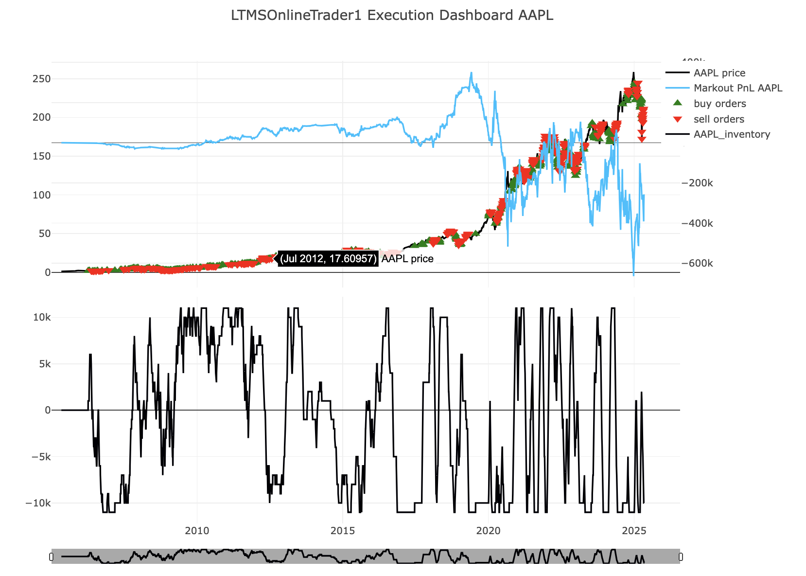
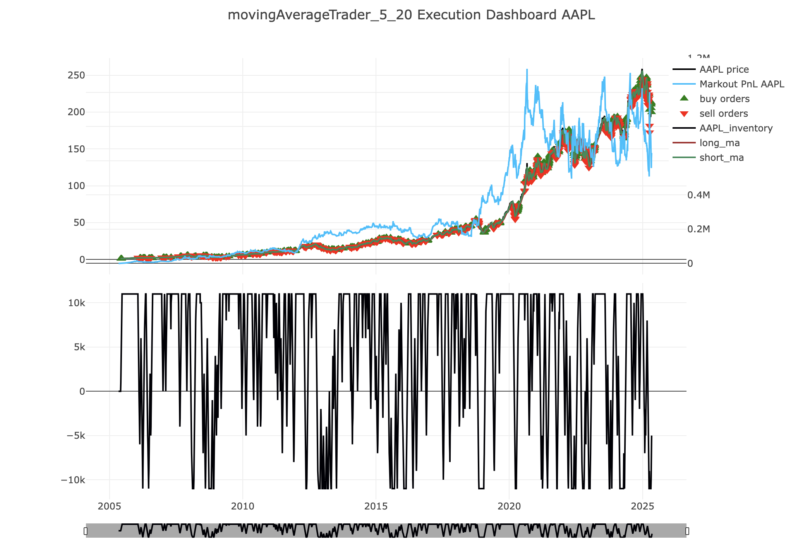
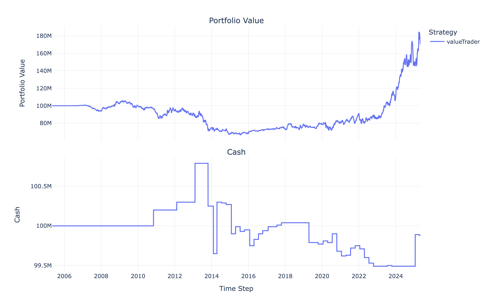

# Systematic Trading Research Project | Momentum, Value & Neural Networks

This repository contains a collaborative Applied Master Project completed as part of the MSc in Financial Engineering at EDHEC Business School.

The project develops and evaluates systematic equity trading strategies across momentum, value, and online-learning approaches within a unified Python backtesting framework. It combines quantitative finance, portfolio construction, and machine learning to assess the profitability, robustness, and implementation of different systematic signals under consistent assumptions.
 
## Contributors

This project was developed collaboratively by:

- Ndèye Arame Mbengue
- Elyazid Benkhadra
- Léo Giordano

## My Contribution

My main contribution focused on the design and implementation of the **cross-sectional value strategy**, while also contributing to the broader backtesting and analytics framework and to the comparative evaluation and presentation of results.

More specifically, I:
- contributed to the Python backtesting and analytics stack
- designed and implemented the value strategy
- contributed to the comparative interpretation and presentation of project results

## Project Scope

The project studies multiple systematic trading styles on a broad US equity universe over a long historical horizon. 

The repository currently contains:
- a modular Python backtesting framework
- strategy modules for momentum, value, online logistic learning, and LSTM-based forecasting
- demo notebooks for momentum and value research
- Plotly / Streamlit dashboards for execution and P&L analysis
- the market and fundamental datasets used in the project

## Repository Structure

``` 
AMP-Algo-Trading-Final/
├── st_main.py                   # Streamlit entrypoint (runs backtests + dashboard)
├── momentum.ipynb               # Momentum demo notebook
├── value.ipynb                  # Value demo notebook
├── requirements.txt
├── backtesterClass/             # Core engine
│   ├── analysisClass.py         # Plotly dashboards (price / indicators / PnL / AUM / inventory)
│   ├── orderBookClass.py        # OHLCV loader, time-stepping, current/future price handling
│   ├── orderClass.py            # Order creation, next-day fills, PnL & inventory updates
│   ├── tradingStratClass.py     # Base autoTrader (AUM, inventory, PnL book-keeping)
│   └── streamlit_dashboard.py   # Streamlit wrapper
├── strats/                      # Strategy implementations
│   ├── movingAverageStrat.py    # MA crossover + stop-loss   
│   ├── rsiStrat.py              # RSI overbought/oversold + exits     
│   ├── momentumStrat.py         # MA crossover + RSI filter (combined momentum) 
│   ├── momentumOnlineLearn.py   # Online linear model on engineered features (river)   
│   ├── LTSMOnlineLearn.py       # Online LSTM forecaster (deep_river)      
│   └── valueStrat.py            # Fundamentals-based long/short, quarterly rebalancing  
├── utils/
│   ├── utils.py                 # Global performance plots
│   └── debug.py                 # Logging helper
├── data/
│   ├── all_ohlcv_data.csv       # OHLCV panel (multi-ticker)   
│   └── fundamentals_wide.csv    # Fundamentals with release_date per metric/ticker 
└── Results/
    └── folder.txt               # Placeholder  

```

# Backtesting Framework   

The project uses a unified event-driven backtesting framework designed to evaluate different strategy families under consistent assumptions.  

## Core assumptions
- **Investment universe:** S&P 500 equities   
- **Time horizon:** ~20 years   
- **Execution:** next-period close   
- **Transaction cost:** 0.02% per trade   
- **Tracking:** inventory, executed trades, realized and markout P&L   
- **Analysis layer:** Plotly dashboards, Streamlit interface, SQLite execution storage


## Framework capabilities   

The framework is designed to:    
- generate and execute strategy signals under common execution assumptions   
- track portfolio-level and asset-level positions, trades, and P&L   
- support multiple strategy families within the same research stack   
- visualize strategy behaviour through reusable dashboards    
- persist execution and analytics outputs for post-trade analysis   
  
# Strategies Implemented   

**1. Moving Average Crossover (movingAverageStrat.py)**  
- **Signal:** short vs long SMA crossover per asset    
- **Trading logic:** buy on golden cross, sell/short on death cross 
- **Risk controls:** max inventory per asset and stop-loss rules 

**2. RSI Strategy (rsiStrat.py)**    
- **Signal:** RSI computed via EMA-smoothed gains and losses   
- **Entries:** buy when RSI ≤ buy threshold; sell/short when RSI ≥ sell threshold   
- **Exits:** partial or full exits as RSI mean-reverts toward 50  
- **Risk controls:** inventory cap and stop-loss   

**3. Hybrid Momentum Strategy (momentumStrat.py)**  
- **Signal:** moving-average crossover combined with an RSI filter   
- **Trading logic:** go long when short MA > long MA and RSI is not overbought; short when short MA < long MA and RSI is not oversold   
- **Objective:** reduce false entries relative to standalone MA or RSI rules   
- **Exits:** RSI reversion bands around 50, with inventory cap and stop-loss controls   

**4. Value Strategy (valueStrat.py)**   
- **Strategy type:** quarterly dollar-neutral cross-sectional long/short strategy      
- **Data source:** fundamentals_wide.csv, using release-date-aligned fundamental data   
- **Data handling:**  forward-fill between disclosures, median imputation for remaining missing values   
- **Data quality filter:** excludes names with more than 40% missing selected metrics   
- **Signal construction:** computes cross-sectional z-scores and aggregates them into a composite value score   
- **Portfolio construction:** equal-weight top / bottom 10 portfolio construction   
- **Rebalancing**: quarterly on actual post-release dates to reduce look-ahead bias  
- **Position management:** flattens positions in names that drop out of the selected baskets   

**5. Momentum – Online Learning (momentumOnlineLearn.py)**    
- **Features:** RSI, short/long moving averages, lagged returns (1/2/5/10), and rolling cumulative returns   
- **Model:** river pipeline with online scaling and linear classification / regression logic    
- **Target:** forward price ratio over a forecasting window     
- **Loop:** streaming predict → trade decision → incremental learn_one update    
- **Objective:** test whether adaptive online learning adds value relative to static rule-based momentum rules   

**6. LSTM – Online Learning (LTSMOnlineLearn.py)**  
- **Features:** technical features and rolling price buffers  
- **Model:** deep_river / PyTorch LSTM forecasting architecture  
- **Target:** forward price ratio in an online prediction workflow  
- **Workflow:** streaming predict_one / learn_one  
- **Role in the project:** experimental extension of the framework toward adaptive deep-learning-based trading signals   

# Selected Results   
# Value strategy   
The value strategy produced:   
- 70.8% total return  
- 0.32 Sharpe ratio   
- 9.9% volatility    
- $326.9k average PnL per asset  
   
These results were achieved with a quarterly long/short implementation built on release-date-aligned fundamentals, cross-sectional ranking, and equal-weight portfolio construction.   

# Comparative project result     
Across the broader project, the top-performing strategy was a MA–RSI hybrid momentum strategy, which delivered:   
- 178.4% total return    
- 0.624 Sharpe ratio   


# What the Repository Produces   
**The framework outputs:**   
- portfolio and asset-level P&L histories   
- inventory histories  
- executed trade logs  
- indicator time series  
- interactive dashboards for analysis and debugging  
  
**Typical tracked outputs include:**   
- AUM / portfolio value    
- Cash   
- Realized PnL   
- Unrealized / markout PnL   
- Inventory by asset   
- Executed trades   
- Indicators such as RSI and moving averages   


# Preview  










# Getting Started     
install dependencies: 

- pip install -r requirements.txt   
