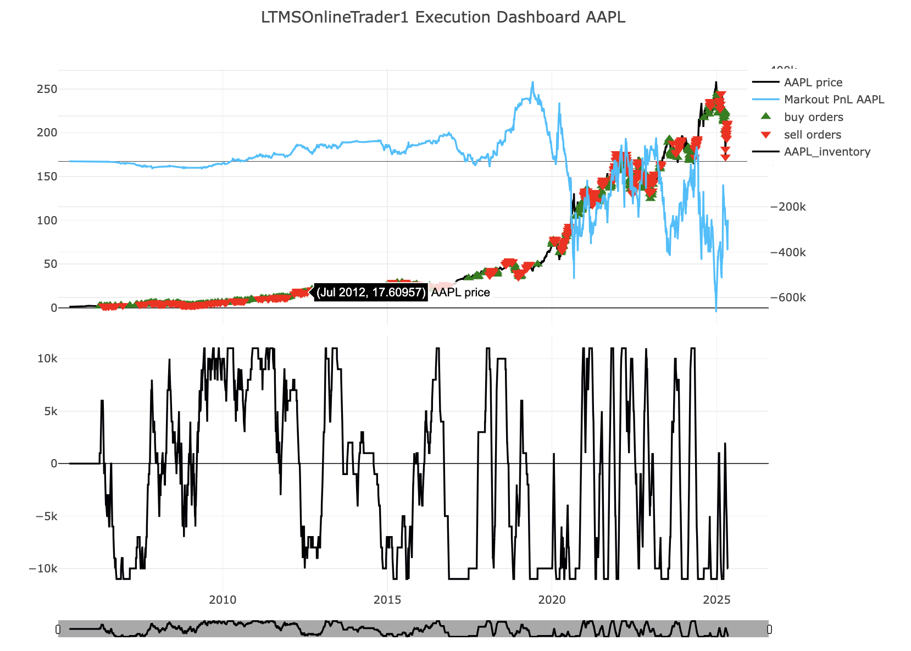

# Algorithmic Trading Strategies - Applied Master Project      
This repository contains my Applied Master Project (AMP) completed as part of the MSc in Financial Engineering at EDHEC Business School. The project develops and evaluates systematic trading strategies across multiple styles, integrating both traditional financial signals and modern machine learning techniques.     

# Project Overview     
The objective of this project is to design, implement, and backtest algorithmic trading strategies that can be applied to equity markets. The work combines quantitative finance, portfolio construction, and data science to assess the profitability and robustness of systematic signals by enabling both traditional factor strategies and online machine learning models.    

# Repository Structure   

```
AMP-Algo-Trading-Final/     
├── st_main.py # Streamlit entrypoint (runs backtests + dashboard)      
├── momentum.ipynb # Momentum demo notebook     
├── value.ipynb # Value demo notebook      
├── requirements.txt       
├── backtesterClass/ # Core engine     
│ ├── analysisClass.py # Plotly dashboards (price/indicators/PnL/AUM/inventory)      
│ ├── orderBookClass.py # Loads OHLCV, time-stepping, current/future price      
│ ├── orderClass.py # Order creation, next-day fills, PnL & inventory updates       
│ ├── tradingStratClass.py # Base autoTrader (AUM, inventory, PnL book-keeping)       
│ └── streamlit_dashboard.py # Streamlit wrapper       
├── strats/ # Strategies      
│ ├── movingAverageStrat.py # MA crossover + stop-loss      
│ ├── rsiStrat.py # RSI overbought/oversold + exits      
│ ├── momentumStrat.py # MA crossover + RSI filter (combined momentum)      
│ ├── momentumOnlineLearn.py # Online linear model on engineered features (river)       
│ ├── LTSMOnlineLearn.py # Online LSTM forecaster (deep_river)      
│ └── valueStrat.py # Fundamentals-based long/short, quarterly rebalancing        
├── utils/     
│ ├── utils.py # Global performance plots    
│ └── debug.py # Logging helper    
├── data/     
│ ├── all_ohlcv_data.csv # OHLCV panel (multi-ticker)       
│ └── fundamentals_wide.csv # Fundamentals with release_date per metric/ticker    
└── Results/     
└── folder.txt # (placeholder)        

```

# Strategies Implemented

**Moving Average Crossover (movingAverageStrat.py)**         
- Signal: short vs long SMA crossover (per asset).   
- Trading: buy on golden cross, sell/short on death cross.   
- Risk controls: max inventory per asset; basic stop-loss on both long/short.      

**RSI Mean-Reversion (rsiStrat.py)**     
- Signal: RSI via EMA of gains/losses.    
- Entries: buy when RSI ≤ buyThreshold; sell/short when RSI ≥ sellThreshold.    
- Exits: partial/total exits as RSI mean-reverts toward 50; inventory cap + stop-loss.          

**Momentum (Hybrid) (momentumStrat.py)**         
- Signal: MA crossover combined with RSI filter to avoid chasing overstretched moves.       
- Logic: go long when shortMA > longMA and RSI not overbought; short when shortMA < longMA and RSI not oversold.       
- Exits: RSI reversion bands around 50; inventory cap + stop-loss.       

**Value (Long/Short) (valueStrat.py)**      
- Data: fundamentals_wide.csv (e.g., pe_ratio, pb_ratio, dividend_yield, quick_ratio, current_ratio) with true release_date per metric.     
- Rebalancing: quarterly after the first available release date following quarter-end (prevents look-ahead).
   
Portfolio construction:    
- Rank universe by selected value features (checks essentials present).     
- Long cheapest (e.g., low PE/PB, high dividend yield), short most expensive.        
- Flattens positions in names that drop out of the selected baskets.          
- Risk: per-asset max position; cash/AUM tracked.    

**Momentum – Online Learning (momentumOnlineLearn.py)**    
- Features: RSI, short/long MAs, lagged returns (1/2/5/10), rolling cumulative returns.     
- Model: river pipeline (scaler → online linear model w/ elastic-net via SGD; optional feature selection/interaction as coded).      
- Target: forward price ratio over a forecasting window (sliding/streaming).       
- Loop: predict → trade logic (thresholds on predicted movement + technical context) → learn_one on the fly.       

**LSTM – Online Learning (LTSMOnlineLearn.py)**    
- Features: same engineered features as above; rolling price buffers.      
- Model: deep_river.neural_net.Forecaster (LSTM with configurable hidden size, LR, append_predict).     
- Target: forward price ratio; streaming predict_one / learn_one with river metrics (code uses metrics.ROCAUC() as a placeholder metric tracker).

# What Results Does the Repo Produce?
The framework outputs time-series plots and internal histories for:       
AUM (portfolio value), Cash, Realized PnL, Unrealized PnL, Inventory (per asset)   

Example:       



**Getting Started**       

- pip install -r requirements.txt   
